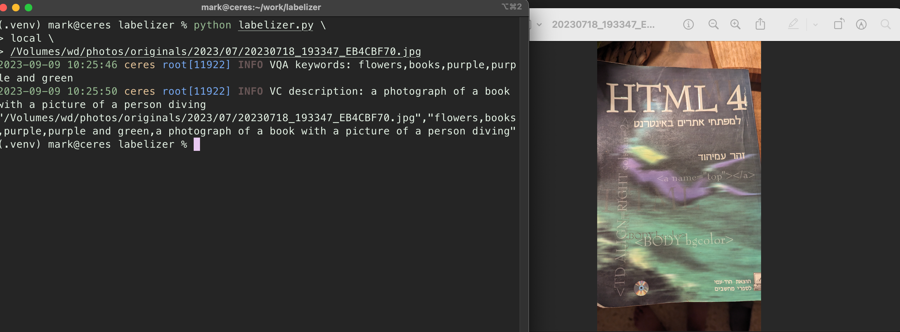
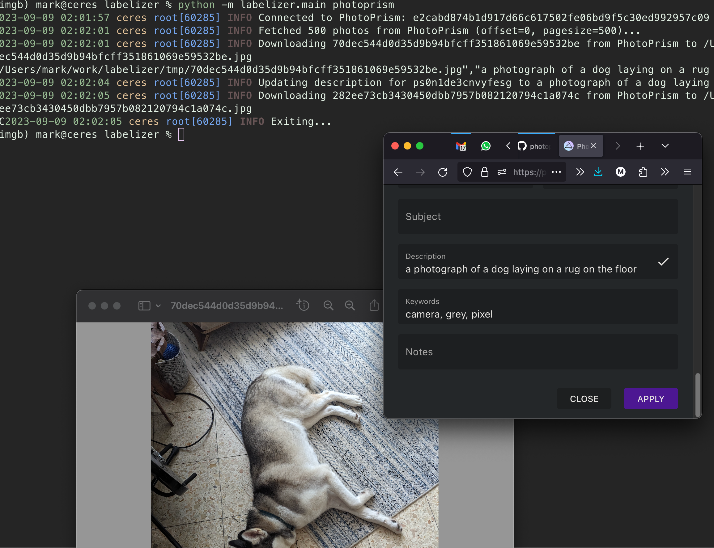

# Overview
This repository contains glue code for automating captioning and keywording for PhotoPrism/local files. It's based on the Transformers library and requires a HuggingFace account/token to ensure models can be fetched automatically.

The PhotoPrism client implementation has been vendored separately.

## Supported Models and modes
* Blip (sentence-based captioning)
* Blip in VQA mode (better for keywording)
* Blip2

## Hardware requirements
* All inference can run on the CPU; a generous amount of RAM is recommended.
* GPU/CUDA acceleration is automatically enabled.

## Usage
Ensure you have a huggingface account and token! It's also recommended to use `direnv` or `dotenv` to automatically apply `.env` files.

### Configuration
```
python3 -m virtualenv .venv && source .venv/bin/activate && pip install -r requirements.txt
cp .env.example .env && vim .env && source .env
```
See [example config](.env.example) for explanation on each envar.


### Modes of Operation

#### local
```
source ./.venv/bin/activate && source .env
python labelizer.py local <path to file / folder / url> -o output.csv
```


#### Photoprism
Make sure you've entered your PhotoPrism credentials in .env;

```
source ./.venv/bin/activate && source .env
python labelizer.py photoprism # pass -r to skip updating PP photo details
```

Screenshots
===========






