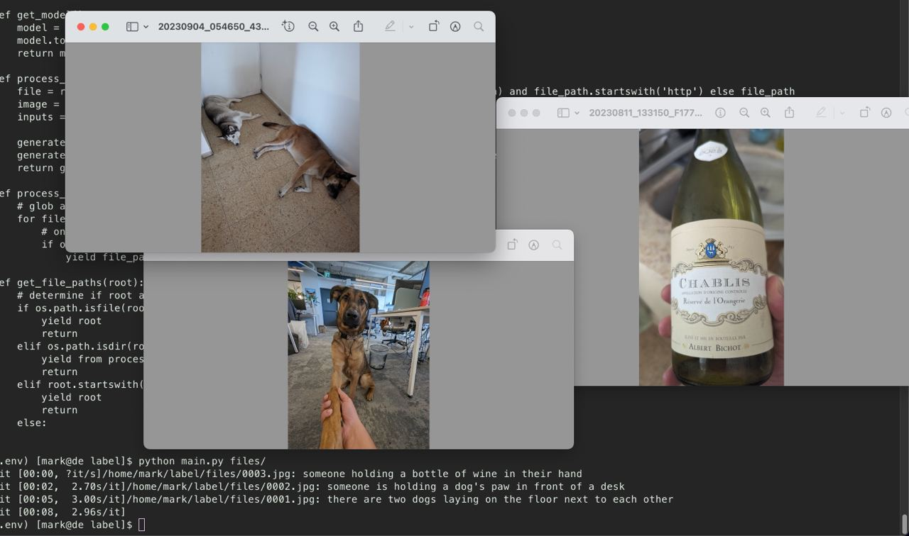

Usage
=====

```git submodule init && git submodule sync --recursive
python3 -m virtualenv .env && pip install -r requirements.txt
cp .env.example .env && vim .env
# make sure to choose a suitable model in .env, e.g., salesforce/blip2 etc
python3 -m labelizer.main <local|photoprism> [path]
```

if photoprism mode is chosen, make sure to expose the relevant envars (see `.env.example`);
otherwise, the code will try to caption all images in `path`.

Screenshots
===========




